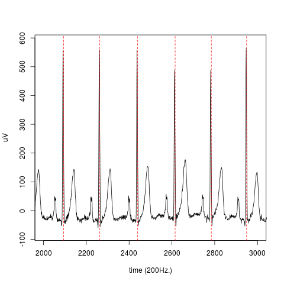

# EP limited
wrapper around eplimited QRS detector to make it accessible from R

## Example

```
data(ecg)
plot(ecg, type="l", xlim=c(10*200, 15*200))
abline(v = qrsdet(ecg), col=2, lty=2)
```



## Installation

From R, first install the `devtools` library, then do:

```
library(devtools)
install_github("gdupret/eplimited")
```
